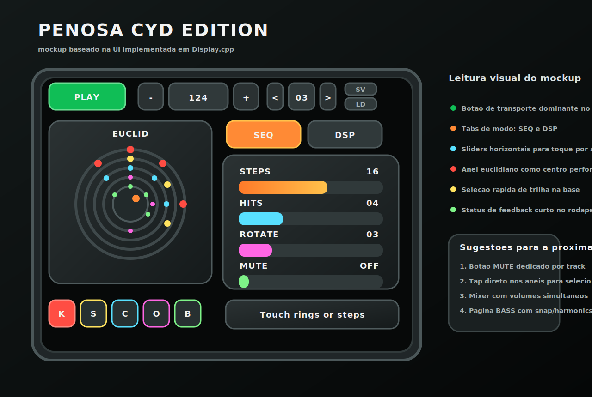

# Penosa DM CYD Edition

Variante paralela do Penosa DM voltada ao hardware `ESP32 Cheap Yellow Display`
2.8" resistivo, mantendo o projeto original intacto.



## Objetivo

Esta versao prioriza:

- uso exclusivo da tela touchscreen do CYD
- DSP e audio no Core 1
- UI, touch e SD no Core 0
- eliminacao de encoders, botoes, WiFi e BLE
- estetica lo-fi usando o DAC interno do ESP32 por padrao

## Estrutura

- `platformio.ini`: ambiente dedicado `esp32-cyd`
- `src/CYD_Config.h`: pinout, calibracao de touch, modo de audio e pastas do SD
- `src/main.cpp`: boot enxuto e criacao das tasks
- `src/ui/Display.cpp`: inicializacao da task de display (nova UI)
- `src/ui/UiApp.cpp`: shell da nova UI com navegacao por telas
- `src/control/InputManager.cpp`: polling do XPT2046 e mapeamento de toque
- `src/storage/PatternStorage.cpp`: save/load de patterns em JSON no SD
- `src/storage/WavSampleBank.cpp`: leitura basica de pequenos `.wav`
- `src/audio/*`: copia adaptada do nucleo DSP para esta variante

## Hardware alvo

Configuracao padrao pensada para a revisao comum do `ESP32-2432S028R`.

### Pinos principais

- TFT: definidos em `CYD_Config.h`
- Touch resistivo XPT2046: definidos em `CYD_Config.h`
- SD: definidos em `CYD_Config.h`
- Audio: DAC interno habilitado por padrao

### Nota sobre revisoes do CYD

Existem placas CYD com roteamentos diferentes para touch e SD. Por isso:

- todo o pinout foi centralizado em `src/CYD_Config.h`
- existe a flag `UseSharedSpiWiring` para casos de fiação/mod compartilhando SPI
- se o touch vier invertido ou deslocado, ajuste `TouchMinX`, `TouchMaxX`,
  `TouchMinY` e `TouchMaxY`

## UI (nova, padrao)

### Topo

- `PLAY/STOP`
- `BPM - / valor / +`
- selecao de slot
- `SV` para salvar pattern atual no SD
- `LD` para carregar pattern do SD

### Esquerda

- visualizador de ritmos euclidianos em aneis concentricos
- cinco botoes de trilha: `K`, `S`, `C`, `O`, `B`

### Direita

- tab `SEQ`: edicao de steps, hits, rotation e mute
- tab `DSP`: pitch, decay/release, tone/brightness e drive/level
- rodape com feedback rapido de estado

## Armazenamento no SD

Pastas preparadas automaticamente:

- `/patterns`
- `/samples`

Patterns sao gravados como JSON em:

- `/patterns/pattern_00.json`
- `/patterns/pattern_01.json`
- ...

O snapshot inclui:

- BPM
- track ativa
- steps, hits, rotation e mute por track
- parametros das vozes
- ganho por voz e master
- parametros do BassGroove

## Audio

Por padrao a variante usa:

- DAC interno do ESP32
- `I2S_NUM_0`
- espelhamento do sinal nos dois canais do DAC interno

Se quiser migrar para I2S externo:

- desative `UseInternalDac` em `src/CYD_Config.h`
- ajuste os pinos `ExtI2SBck`, `ExtI2SWs` e `ExtI2SData`

## Build

Dentro desta pasta:

```powershell
python -m platformio run
```

Build padrao usa a nova UI (sem fallback legado).

Para gravar:

```powershell
python -m platformio run --target upload
```

Monitor serial:

```powershell
python -m platformio device monitor
```

## Estado atual

- compila com sucesso
- pronto para teste em hardware
- mockup e firmware estao alinhados no layout geral

## Proximas melhorias sugeridas

- calibracao guiada do touchscreen na primeira inicializacao
- gesto de toque nos aneis para selecionar a trilha diretamente
- pagina extra de bass com `snap` e `harmonics`
- pagina de mixer dedicada
- cache opcional de samples `.wav` em PSRAM quando disponivel
