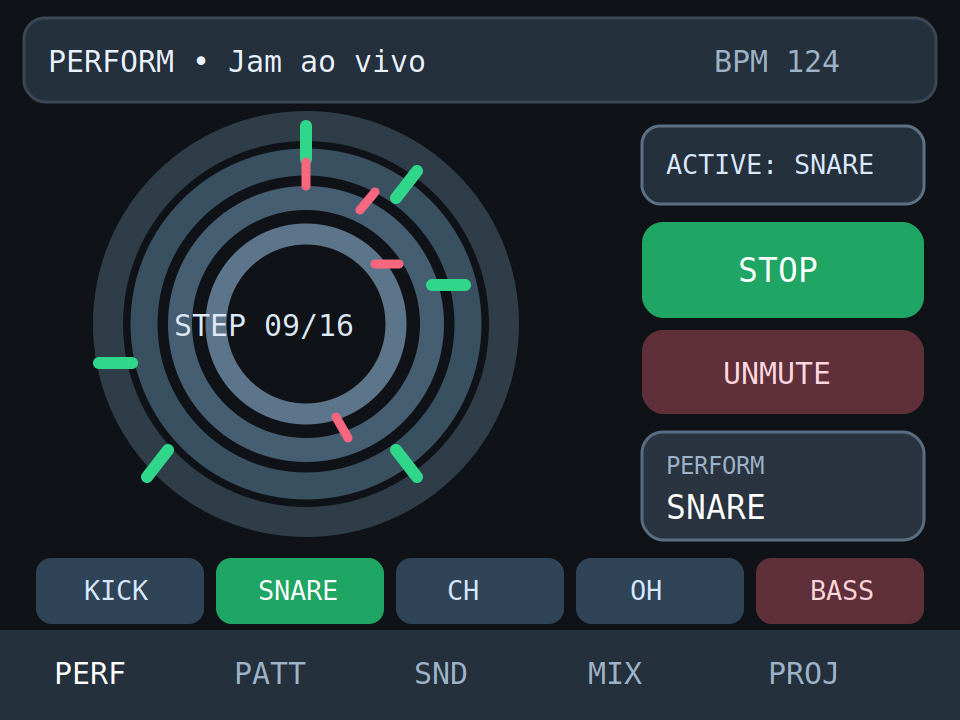
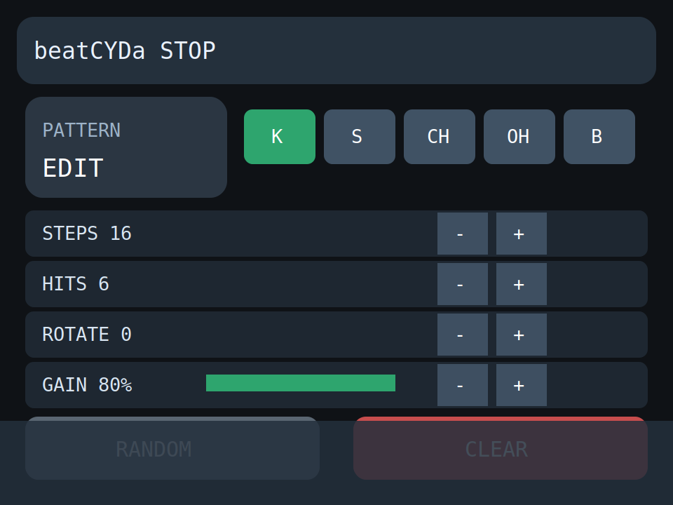
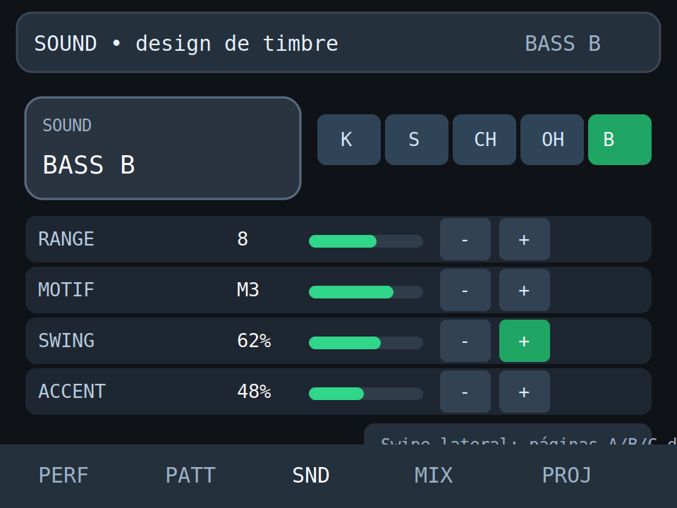
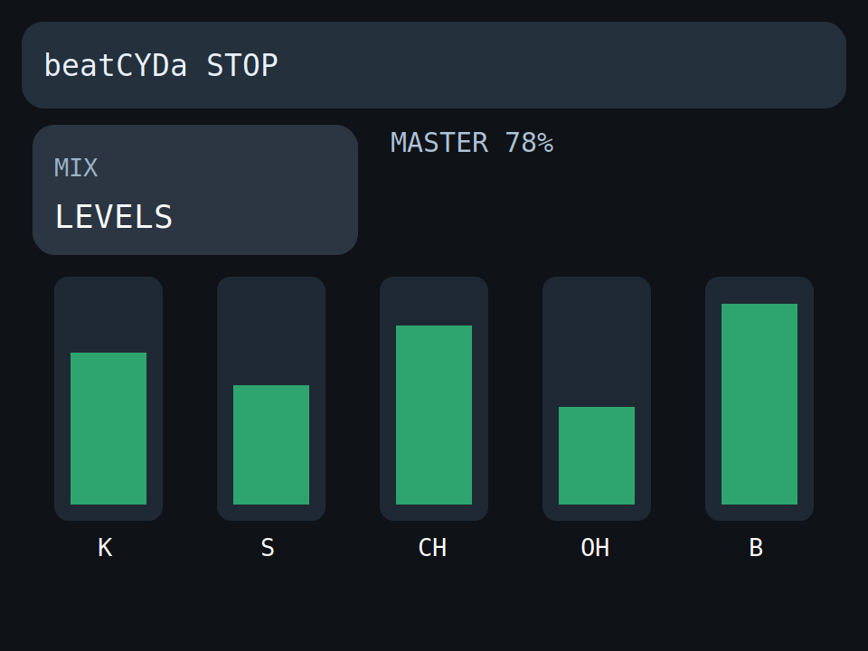
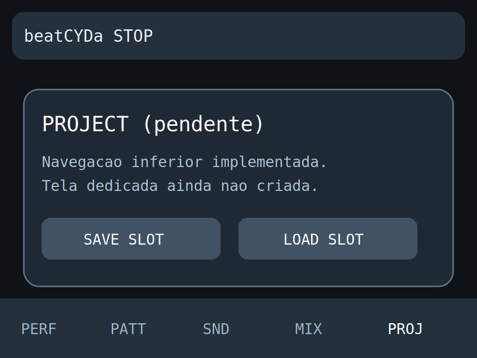

# Avaliação de progresso das telas (beatCYDa)

Este documento resume o estado **implementado no código** das telas da nova UI (`UiApp`) e traz mockups atualizados para cada uma.

## Resumo executivo

| Tela | Estado | Progresso estimado | Observações |
|---|---|---:|---|
| Perform | Implementada e navegável | 90% | Fluxo principal pronto (play/mute/seleção de trilha). |
| Pattern | Implementada e navegável | 85% | Edição de steps/hits/rotate/gain com hold acelerado; random ainda desabilitado. |
| Sound | Implementada e navegável | 85% | Edição de pitch/decay/timbre/drive com hold acelerado. |
| Mix | Implementada e navegável | 80% | Faders por trilha com captura/drag; foco em ganho por voz. |
| Project | Navegação criada, conteúdo pendente | 20% | Botão de navegação existe, mas não há render/fluxo dedicado. |

## Critério utilizado

A avaliação considera:

1. **Render da tela** (layout e componentes).
2. **Interação por toque** (tap/hold/drag).
3. **Integração com ações da engine** (`dispatchUiAction`).
4. **Nível de acabamento** (estados desabilitados, ações faltantes, fluxos incompletos).

## Evidências por tela

### 1) Perform

- Renderiza botões `PLAY/STOP`, `MUTE/UNMUTE`, card de status e chips de trilha.
- Trata toque para alternar play, mute e seleção de trilha.
- Reflete estado atual (`bpm`, trilha ativa e mutes).

Mockup: `docs/mockups/screen-perform.svg`

### 2) Pattern

- Renderiza card de cabeçalho, chips de trilha e 4 linhas (`STEPS`, `HITS`, `ROTATE`, `GAIN`).
- Implementa `+/-` com repetição por hold acelerado.
- Botão `CLEAR` funcional (zera hits/rotate da trilha ativa).
- Botão `RANDOM` presente, porém desabilitado.

Mockup: `docs/mockups/screen-pattern.svg`

### 3) Sound

- Renderiza card de identidade da trilha (`KICK`, `SNARE`, etc.), chips de trilha e 4 linhas (`PITCH`, `DECAY`, `TIMBRE`, `DRIVE`).
- Todas as linhas com barra visual e ajuste por `+/-`.
- Hold acelerado implementado como em Pattern.

Mockup: `docs/mockups/screen-sound.svg`

### 4) Mix

- Renderiza card `MIX`, leitura de `MASTER` e 5 faders verticais de trilha.
- Suporta captura no toque, atualização contínua no drag e soltura.
- Integração com ação `SET_VOICE_GAIN` por trilha.

Mockup: `docs/mockups/screen-mix.svg`

### 5) Project

- A navegação inferior possui botão `PROJ` e troca de `UiScreenId`.
- Ainda não existe tela de conteúdo específica para Project (render/ações próprias).

Mockup (conceitual de estado atual): `docs/mockups/screen-project.svg`

## Mockups gerados

- 
- 
- 
- 
- 

## Próximos passos recomendados

1. Implementar `ProjectScreen` com save/load de slot e feedback de operação.
2. Ativar lógica de `RANDOM` na Pattern.
3. Adicionar indicadores de `dirty`/feedback visual para ajustes contínuos.
4. Revisar consistência de espaçamentos e nomenclaturas entre telas.

## Próxima etapa assumida (Sprint 7 — Polimento)

Foi iniciada a etapa de polimento com foco em telemetria leve da UI e remoção de timings hardcoded.

### Checklist do que foi feito até agora

- [x] Métricas de frame na UI (FPS) com atualização periódica.
- [x] Métrica de heap livre exibida na barra superior.
- [x] Centralização de tempos de toast e refresh de métricas em `CYD_Config.h`.
- [x] `ProjectScreen` migrada para usar os novos tempos configuráveis.
- [ ] Revisão final de contraste/estados pressionados em todas as telas.
- [ ] Invalidação fina por regiões (ainda em full redraw por frame).
- [ ] Limpeza final do legado opcional.
